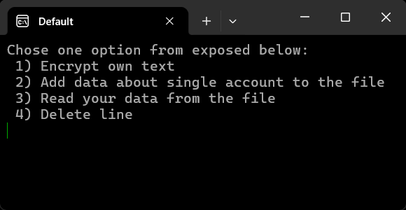

# About the idea and functionality
The idea of this password manager is that you could simply manage your passwords from a console application. So you could start the exe file and check/add/remove your passwords. Also, it has a feature for encrypting text.

# How to use it
When you start the executable file ("manager.exe" for Windows, or "manager" for Linux, which you can find in the "executables" folder), you will see that the program asks you to enter the key.

So, you must enter your key - any int number, but it's better to choose a small one. Because if you choose a too big number, the program will work a bit slower; you won't notice it in most cases, but anyways.
So, just enter the number and press enter to continue:

## Option 1 - "Encrypt own text"
It's an option that you should use to encrypt or decrypt anything by Caesar's cipher, without touching your passwords file or anything.

After you press enter, you will see a menu - it represents all the features you can try. Let's check them more closely.

To choose the option, you need to enter the number of it:

And then press enter, and you will find yourself in the option settings; it will ask you for some information. Option "1) Encrypt own text":

So, now you need to enter your key and press enter:

Next, you want to enter the message or any text you want to encrypt. The only required thing is that every single letter from it must be in your alphabet.

So, now we encrypted our message, and we can see the result of encryption. If you want to try to decrypt my message, you should use the same key as I, but negative. So it's -30, and enter my message - "Wt117Dc&7!1sb". If you did everything right, you will see "Hello, world!" as the decryption result.

## Option 2 - "Add data about single account to the file"
It's an option used to add some information about one account into your file with data.

To choose it, you should enter the number of it (2) and press enter. The same as in any other function. Then you will see the next thing on your screen:

So, you should write the name of your platform and press enter. Then you will see that the program asks you to enter Username - write it and press enter to confirm. Next step is to enter e-mail; enter it, you can enter it both with @domain (gmail.com for example) or without, it does not matter. Next, you will need to enter the password:

Then press enter to confirm all the information (there is no way back, only closing the program tbh), and you will see the next thing:

That means you added your data about the account, and the line:
"Platform: Vx:w#q Username: $1psW1# wrw[z el.-mail: w1# wrw[z%Ev3px1Cr73 Password: ,79a.tr!t:" (in my case)
is your encrypted data, which was added to the file with all that data (by default it's "data.pass").

## Option 3 - "Read your data from the file"
Used to read all data about your accounts that are written to the file. If you choose it, you will see a table like this:

## Option 4 - "Delete line"
As it follows from the name, this function will delete one line (account) from the file with your data (passwords). If you choose it, you will see a screen with all your passwords, and you will be supposed to enter the line which you want to delete:

After you enter the line number and press enter, you will see a screen that says that you successfully deleted line number x; I've chosen line number 2, so it says 2 instead of x. If you check your accounts data through "Read your data from the file", you will find out that this line disappeared.

If you misclicked and chose the "Delete line" option accidentally, you can enter number 0 (or any other number of a line that does not exist), and none of the lines will be deleted.

# How to create a custom alphabet?
To create that alphabet, you want to copy my repository somewhere on your computer, open the file "main.c", and add all your wanted symbols to line 16, in the array "alphabet". The only unwanted symbols are '\n' and '\0'; everything else is good to add.

# How does it work?
It repeats the "Caesar cipher". So, we have our alphabet and a key to encrypt. The key is an int number; it can be either positive or negative. If the number is negative, then we move to the left and choose the letter; if positive - to the right.

In this way, if we have the alphabet {"abcdz"} and want to encrypt the letter 'a' with key 1, we will encrypt it as 'b', but if the key is -1 - it will be encrypted as 'z'. If the key is 2, it's going to be 'c', and if the key is -2, it's going to be 'd'. But if the key is too long, like 11 (it's bigger than our alphabet), then we will do this operation:

id = (cur + key + alphabet_size) % alphabet_size;
id = (0 + 11 + 5) % 5; -> id = 1

where zero is the id of the character in the alphabet, so our encrypted 'a' is 'b' now.

To decrypt our letter, we should encrypt it again, but use -key.